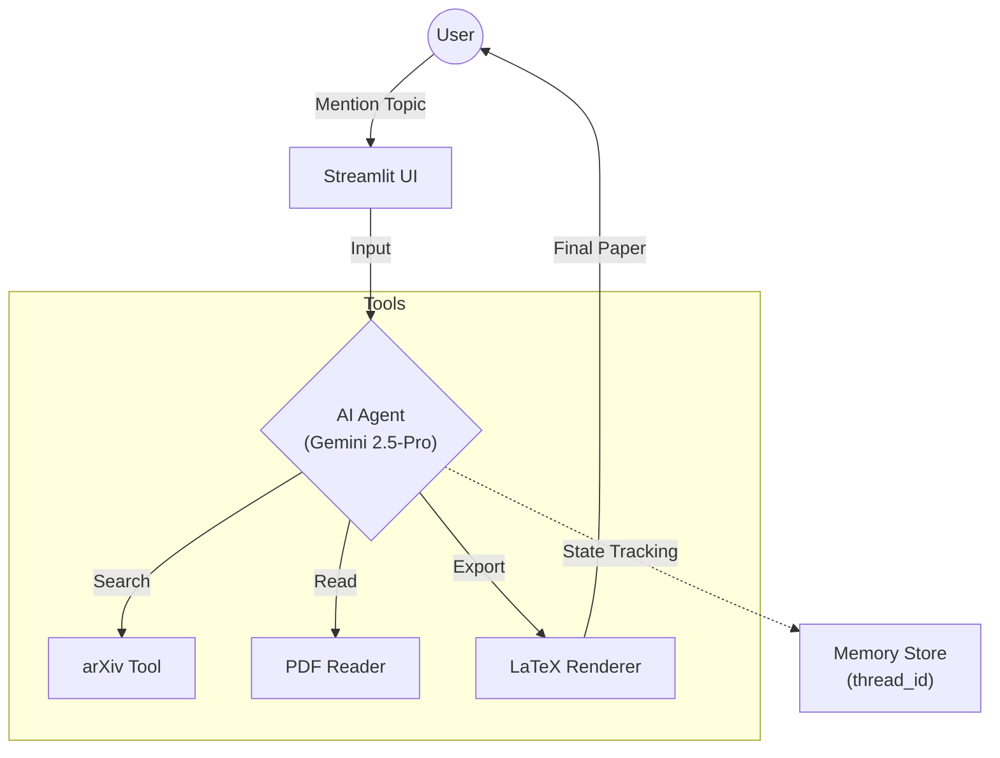

<div align="center">

# 🧬 AI Researcher: The Autonomous Scholar
### *Browse, Analyze, and Author Research Papers in 2-3 Minutes.*

[](https://www.python.org/)
[](https://langchain-ai.github.io/langgraph/)
[](https://deepmind.google/technologies/gemini/)
[](https://streamlit.io/)
[](https://opensource.org/licenses/MIT)

<p align="center">
  <a href="#-overview">Overview</a> •
  <a href="#-key-features">Features</a> •
  <a href="#-architecture">Architecture</a> •
  <a href="#-setup-and-installation">Setup</a> •
  <a href="#-usage">Usage</a>
</p>

</div>

---

## 📖 Overview

**AI Researcher** is a cutting-edge **Agentic AI Workflow** designed to automate the heavy lifting of academic research. Unlike simple summarizers, this agent acts as an end-to-end research assistant that can autonomously browse the latest findings on **arXiv**, read complex PDF documents, identify promising research directions, and compile a formatted **LaTeX** research paper—complete with mathematical equations and citations.

Built using **LangGraph** for sophisticated state management, the system allows the agent to maintain context over long research cycles, ensuring the final output is coherent and ready for publication.

---

## ✨ Key Features

* **🧠 Agentic Workflow:** Uses **LangGraph** nodes and edges to coordinate searching, reading, and writing phases.
* **📚 Deep Literature Review:** Autonomously queries the **arXiv API** to find recently published papers on any specified topic.
* **👁️ PDF Comprehension:** Integrated `read_pdf` tool extracts full-text content from academic papers for in-depth analysis.
* **📝 Ready-to-Publish Output:** Generates professional research papers with mathematical rigor, rendered via **Tectonic** into high-quality LaTeX PDFs.
* **💬 Interactive Research:** A **Streamlit-powered** frontend allows you to guide the agent through the discovery and writing process.

---

## 🏗️ Technical Architecture

The system operates as a **ReAct Agent** cycle, where the Gemini 2.5-Pro "Brain" decides which tool to use based on the research stage.



---

## 🛠️ Technology Stack

| Component | Technology | Role |
| --- | --- | --- |
| **Orchestration** | **LangGraph** | Node-based agentic workflow management |
| **LLM Core** | **Gemini 2.5-Pro** | High-reasoning model for research analysis |
| **Data Retrieval** | **arXiv API** | Access to 2M+ scholarly articles |
| **PDF Extraction** | **PyPDF2** | Parsing complex academic documents |
| **PDF Generation** | **Tectonic (LaTeX)** | Rendering ready-to-publish documents |
| **Frontend** | **Streamlit** | Seamless user interface for real-time interaction |

---

## 🚀 Setup and Installation

### 1. Prerequisites

Ensure you have **Python 3.11+** and **Tectonic** installed on your system (required for PDF rendering).

### 2. Clone & Environment

```bash
git clone [https://github.com/YOUR_USERNAME/AI-Researcher.git](https://github.com/YOUR_USERNAME/AI-Researcher.git)
cd AI-Researcher
pip install uv  # Highly recommended
uv sync         # Installs all dependencies

```

### 3. API Configuration

Create a `.env` file in the root directory:

```env
GOOGLE_API_KEY="your_gemini_api_key"

```

---

## 🎯 Usage

1. **Launch the Frontend:**
```bash
streamlit run frontend.py

```


2. **Start Researching:** Enter a topic in the chat (e.g., *"Recent breakthroughs in Quantum Error Correction"*).
3. **Refine & Author:** * Sora will browse arXiv and suggest relevant papers.
* Select a paper for the agent to analyze in-depth.
* The agent will propose new research ideas; choose one to generate your full LaTeX paper.


4. **Download:** Once the process is complete, grab your generated PDF from the `output/` folder.

---

<div align="center">
<p>Educational Purpose Only • Developed by @Al.with.Hassan</p>
</div>

```
